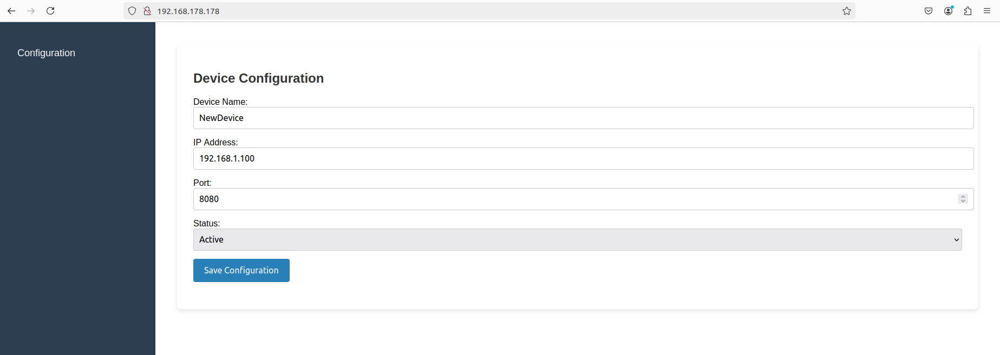

# Nginx Web Server with NodeJs



In this example, NodeJs support has been added to nginx web server. The script S99nodejs is starting the NodeJs. Nginx has been configured to serve as reverse proxy and will forward the HTTP requests to NodeJs.  You will see a basic device management page and for further projects, we will be using this web template.

Thanks to ChatGPT, it created a simple device configuration panel for us. Under /webpage folder, you will see html, js and css files for the web page. In config.json file, device configuration related information are being kept.

### How to Run:
* Simply open a web browser with the device's IP address (http://192.168.178.178/)

### SSH Connection:
Once the board is powered up and connected to the network, you can use SSH to log in remotely:
```
ssh root@192.168.178.178
password: root
```

### Supported boards:
- [x] Raspberry Pi Zero W
- [x] Raspberry Pi 3B+
