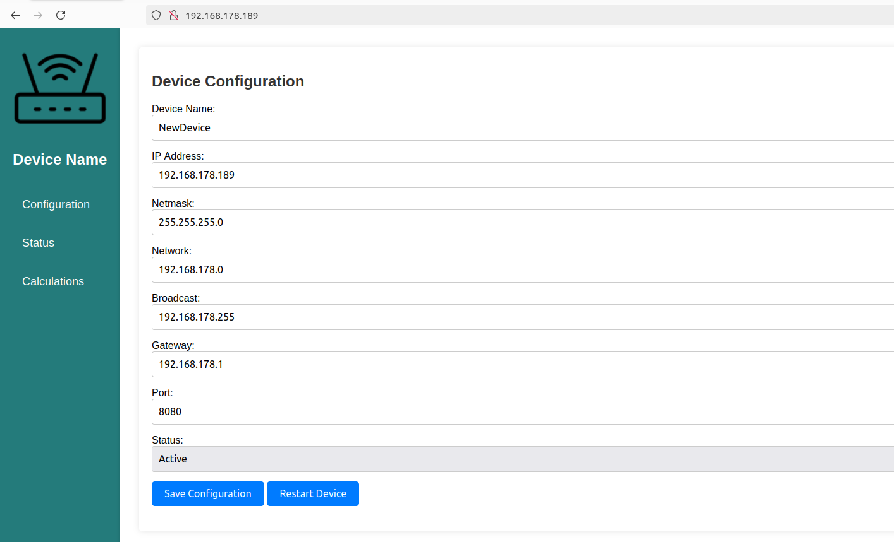
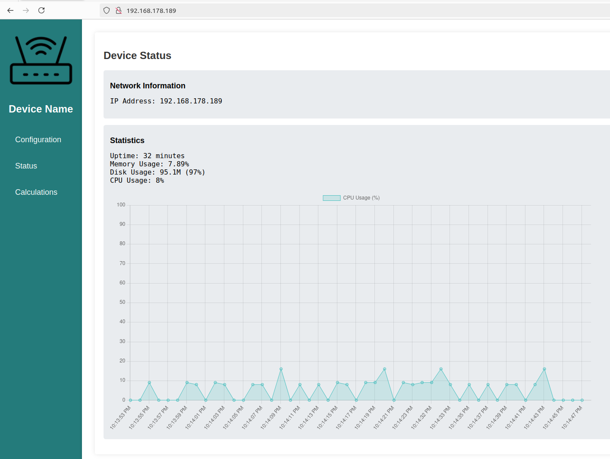
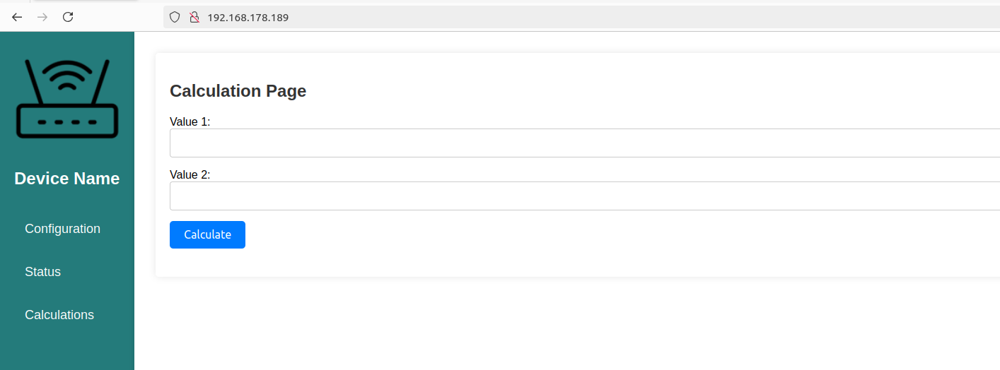
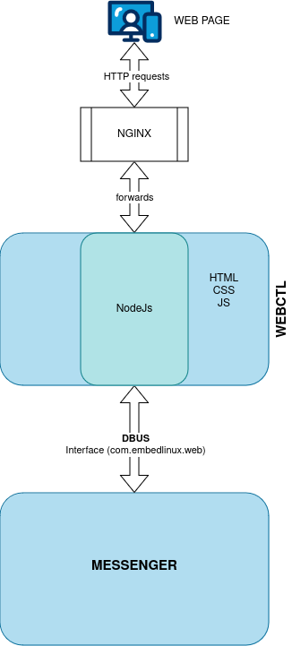

# Web Server with NodeJs and DBUS support

In this example, we will connect web interface with a C program. Web related files and commands are being handled in webctl process. Messenger is the responsible process for parsing and forwarding commands to the related processes. Communication between processes are happening over system DBUS. dbus-node library is being used at web side.

A simple calculation tab has been added to the web GUI. In this tab, two values are sent over DBUS to the messenger process, where they are summed, and the result is returned. WebCtl then displays the result.

Here are the screenshots of the web:





-----
A simple design of the project:



### How to Run:
* Simply open a web browser with the device's IP address (http://192.168.178.178/)

### SSH Connection:
Once the board is powered up and connected to the network, you can use SSH to log in remotely:
```
ssh root@192.168.178.178
password: root
```

### Supported boards:
- [x] Raspberry Pi Zero W
- [ ] Raspberry Pi 3B+
